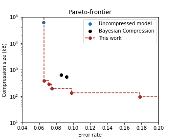

# MIRACLE
This repository contains the code for our recent paper `Minimal Random Code Learning: Getting Bits Back from Compressed Model Parameters' (https://arxiv.org/abs/1810.00440). This is the implementation of MIRACLE for LeNet-5 on MNIST and VGG-16 on CIFAR-10. It is based on Tensorflow (1.3). 

An example model can be trained by running

		python main.py

We used [Deep Compression](https://arxiv.org/abs/1510.00149), [Weightless Encoding](https://arxiv.org/abs/1711.04686) and [Bayesian Compression](https://arxiv.org/abs/1705.08665) as baselines.

The Compression-Error rate exchange is shown below. Lower left is better.

### LeNet-5 on MNIST

### VGG-16 on CIFAR-10

